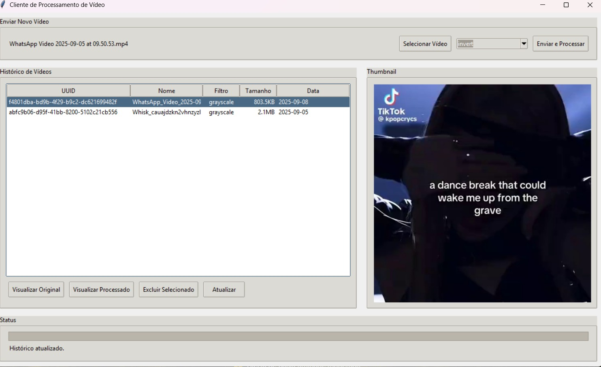

# Projeto de Processamento de Vídeos

Este projeto é uma aplicação para upload, processamento e visualização de vídeos com diferentes filtros. Ele inclui uma interface gráfica para o cliente, um servidor backend para processamento e uma interface web para visualização dos vídeos processados.

---

## Estrutura do Projeto

```
.
├── assets/                  # Recursos estáticos (imagens, etc.)
│   └── interface.jpg        # Imagem da interface do cliente
├── media/                   # Diretório para armazenamento de vídeos e thumbnails
│   ├── incoming/            # Diretório para uploads temporários
│   └── ...                  # Estrutura gerada automaticamente para vídeos processados
├── templates/               # Templates HTML para a interface web
│   └── index.html           # Página principal para visualização dos vídeos
├── client.py                # Interface gráfica do cliente (Tkinter)
├── server.py                # Servidor backend (Flask)
├── database.py              # Configuração e inicialização do banco de dados SQLite
├── videos.db                # Arquivo do banco de dados SQLite
├── .vscode/settings.json    # Configurações do Visual Studio Code
└── README.md                # Este arquivo
```

---

## Requisitos

Certifique-se de ter os seguintes softwares instalados:

- **Python 3.10+**
- **pip** (gerenciador de pacotes do Python)

---

## Instalação

1. Clone este repositório:

   ```bash
   git clone <URL_DO_REPOSITORIO>
   cd SdT3
   ```

2. Crie e ative um ambiente virtual:

   ```bash
   python -m venv venv
   source venv/bin/activate  # No Windows: venv\Scripts\activate
   ```

3. Instale as dependências:
   ```bash
   pip install -r requirements.txt
   ```

---

## Como Rodar

### 1. Inicializar o Banco de Dados

Execute o script `database.py` para criar o banco de dados e a tabela necessária:

```bash
python database.py
```

### 2. Rodar o Servidor

Inicie o servidor Flask:

```bash
python server.py
```

O servidor estará disponível em `http://127.0.0.1:5000`.

### 3. Rodar o Cliente

Abra a interface gráfica do cliente:

```bash
python client.py
```

---

## Funcionalidades

### Cliente (Interface Gráfica)

- **Upload de Vídeos**: Selecione um vídeo e aplique um filtro.
- **Histórico**: Visualize os vídeos enviados e processados.
- **Thumbnails**: Veja a miniatura dos vídeos processados.
- **Exclusão**: Exclua vídeos diretamente da interface.

### Servidor

- **Processamento de Vídeos**: Aplica filtros como grayscale, canny, sepia, pixelate e invert.
- **API REST**: Endpoints para upload, listagem e exclusão de vídeos.
- **Interface Web**: Página para visualizar vídeos processados.

---

## Estrutura de Diretórios Gerada

Após o upload e processamento, os vídeos são organizados na pasta `media/` da seguinte forma:

```
media/
├── incoming/                # Vídeos enviados temporariamente
├── 2025/
│   ├── 09/
│   │   ├── 05/
│   │   │   ├── <UUID>/
│   │   │   │   ├── original/       # Vídeo original
│   │   │   │   ├── processed/      # Vídeo processado
│   │   │   │   └── thumbs/         # Thumbnail gerada
```

---

## Imagens da Interface

### Interface Gráfica do Cliente



---
